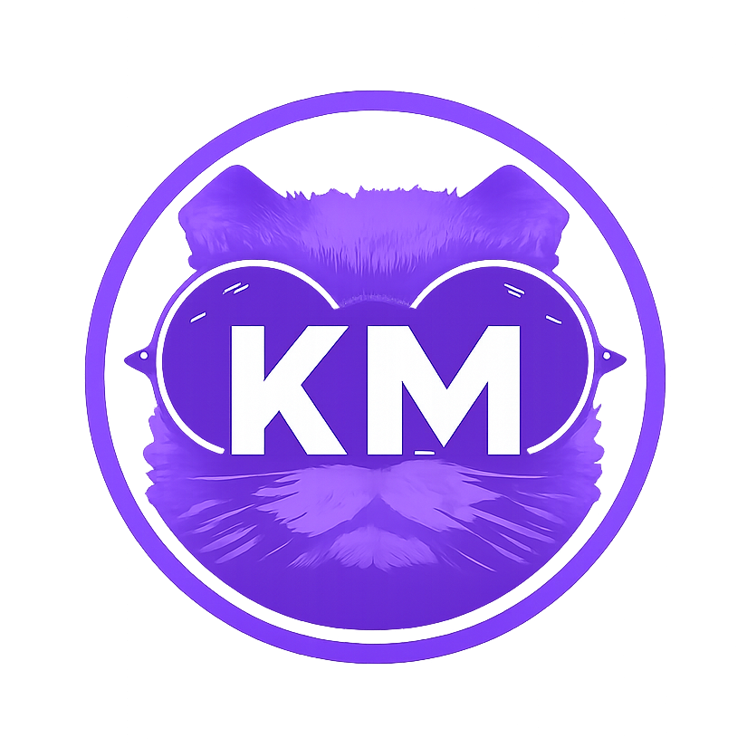

<p align="center">
  <a href="https://kersten.neuman.dev"></a>
</p>

<h1 align="center">Kersten M. Neuman</h1>

<p align="center">
  <strong>Customer Service Professional — Grand Rapids, MI</strong>
</p>

<p align="center">
  <a href="https://kersten.neuman.dev"></a>
  <a href="https://pages.cloudflare.com"></a>
</p>

<p align="center">
  
  
  
  
  
  
  <a href="https://github.com/travisjneuman/ndev.kmn/generate"></a>
</p>

---

Single-page portfolio that loads fast, respects privacy, and just works. No frameworks, no CDNs, no tracking, no build tools. One HTML file, one CSS file, three font files, and a gorgeous full-viewport hero.

## The Stack (All of It)

```
index.html    ← the whole site
css/main.css  ← every style
fonts/        ← Poppins (3 weights, woff2, latin subset)
img/          ← WebP hero + JPG fallback + favicons + OG image
```

That's it. Seriously. `python -m http.server 8000` and you're running.

## Color Palette

<p>
  
  
  
  
</p>

| Token | Hex | Role |
|-------|-----|------|
| `--color-primary` | `#8560f6` | Overlay, accents, buttons, theme |
| `--color-text` | `#777777` | Body copy |
| `--color-heading` | `#222222` | Headlines (print) |
| `--color-white` | `#ffffff` | Text on overlay |

## What You Get

- **Zero dependencies** — no npm install, no node_modules, no package.json
- **Self-hosted Poppins** — no Google Fonts API calls, no GDPR headaches (~23KB total)
- **WebP + JPG hero** — 637KB primary, 946KB fallback, JS detection for progressive enhancement
- **Full SEO suite** — JSON-LD Person schema, OpenGraph, Twitter Cards, canonical URL, sitemap, robots.txt
- **Accessible** — skip-to-content, semantic HTML, ARIA labels, focus-visible, `prefers-reduced-motion`
- **Staggered animations** — GPU-accelerated fade-in on load, glow hover on buttons
- **Print styles** — because someone will Ctrl+P this

## Use as a Template

This repo is a **GitHub template** — click the green **"Use this template"** button to create your own zero-dependency portfolio in seconds. Then customize the content, swap the hero image, update the color palette, and deploy to any static host.

See the [Customization](#customization) section below for what to change.

## Quick Start

```bash
# Python
python -m http.server 8000

# Node
npx serve .

# Then visit http://localhost:8000
```

## Deployment

Auto-deploys from `master` via Cloudflare Pages. Works on any static host — upload the files and go.

## Customization

**Brand color:** edit `--color-primary` and `--color-primary-rgb` in `css/main.css`, update `<meta name="theme-color">` in `index.html`, and `theme_color` in `img/favicon/site.webmanifest`.

**Hero image:** replace both `img/banner-bg.webp` and `img/banner-bg.jpg`. Both formats needed for browser compat.

**Contact info:** edit the `href` attributes on the LinkedIn and Email buttons in `index.html`.

## Typography

**Poppins** — self-hosted, Latin subset only.

| Weight | Where |
|--------|-------|
| 100 (Thin) | Hero name |
| 300 (Light) | Body text, tagline |
| 500 (Medium) | Buttons, headings |

## License

All rights reserved. Personal portfolio website.
